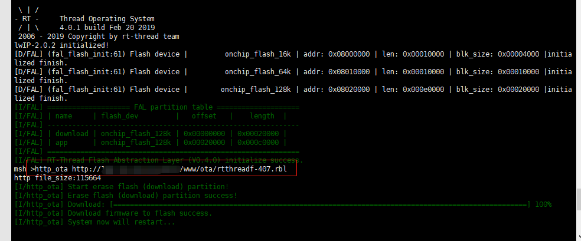

# OTA Downloader

## 1、介绍

本软件包是用于 OTA 升级的固件下载器，该下载器提供多种固件下载方式。开发者可以根据自己的需求灵活选择升级方式，每种升级方式都只需调用一次相应的函数或者执行一次相应的命令就可实现。下面是目前支持的方式。

 - HTTP/HTTPS 协议下载固件
 - YMODEM 协议下载固件

### 1.1 许可证

OTA Downloader package 遵循 Apache2.0 许可，详见 `LICENSE` 文件。

### 1.2 依赖

- RT-Thread 3.0+
- fal 软件包支持
- YMODEM 下载方式依赖于 ymodem 组件
- HTTP/HTTPS 下载方式依赖于 webclient 软件包

## 2、如何打开 OTA Downloader

使用 OTA downloader package 需要在 RT-Thread 的包管理器中选择它，具体路径如下：

```
RT-Thread online packages
    IoT - internet of things  --->
        [*]  The firmware downloader which using on RT-Thread OTA component  --->
            [*]  Enable ota downloader debug
            [*]  Enable HTTP OTA
                (http://xxx/xxx/rtthread.rbl) http ota url
            [*]  Enable YMODEM OTA
```

软件包选项的详细说明如下图：

| 选项 | 说明 |
|-|-|
| Enable ota downloader debug | 使能固件下载器 debug 模式 |
| Enable HTTP OTA | 使能 HTTP/HTTPS 协议下载固件功能 |
| Enable YMODEM OTA | 使能 YMODEM 协议下载固件功能 |

选择完自己需要的选项后使用 RT-Thread 的包管理器自动更新，或者使用 `pkgs --update` 命令更新包到 BSP 中。

## 3、使用 OTA Downloader

在打开 OTA downloader package ，选中相应的功能选项后，当进行 BSP 编译时，它会被加入到 BSP 工程中进行编译。
烧录程序到目标开发板，用户可在 FinSH 终端找到对应的命令。目前软件包支持的升级方式如下表：

| 功能 | 函数调用 | 执行命令 |
|---|---|---|
| 使用 HTTP/HTTPS 协议固件升级 | `void http_ota(uint8_t argc, char **argv)` | `http_ota` |
| 使用 YMODEM 协议固件升级 | `void ymodem_ota(uint8_t argc, char **argv)` | `ymodem_ota` |

### 3.1 YMODEM 协议固件升级命令行演示

推荐使用支持 YMODEM 协议的 Xshell 。在终端输入 `ymodem_ota` 命令后，鼠标右键然后在菜单栏找到用 YMODEM 发送选项发送文件。具体步骤如下图：


### 3.2 HTTP/HTTPS 协议固件升级命令行演示

在终端输入 `http_ota http://xxx/xxx/rtthreadf.rbl` 命令，执行该命令后将会从链接 `http://xxx/xxx/rtthreadf.rbl` 处下载固件。具体步骤如下图所示：



## 4、注意事项

 1. 确保 FAL 中有 downloader 分区。
 2. YMODEM 协议升级固件时，请使用支持 YMODEM 协议的工具。
 3. HTTP/HTTPS 协议升级固件时，需确保远端链接地址可用。

## 5、参考资料

> 《RT-Thread OTA 用户手册》: docs/RT-Thread-OTA 用户手册.pdf

## 6、联系方式 & 感谢

* 维护：RT-Thread 开发团队
* 主页：https://github.com/RT-Thread-packages/ota_downloader
