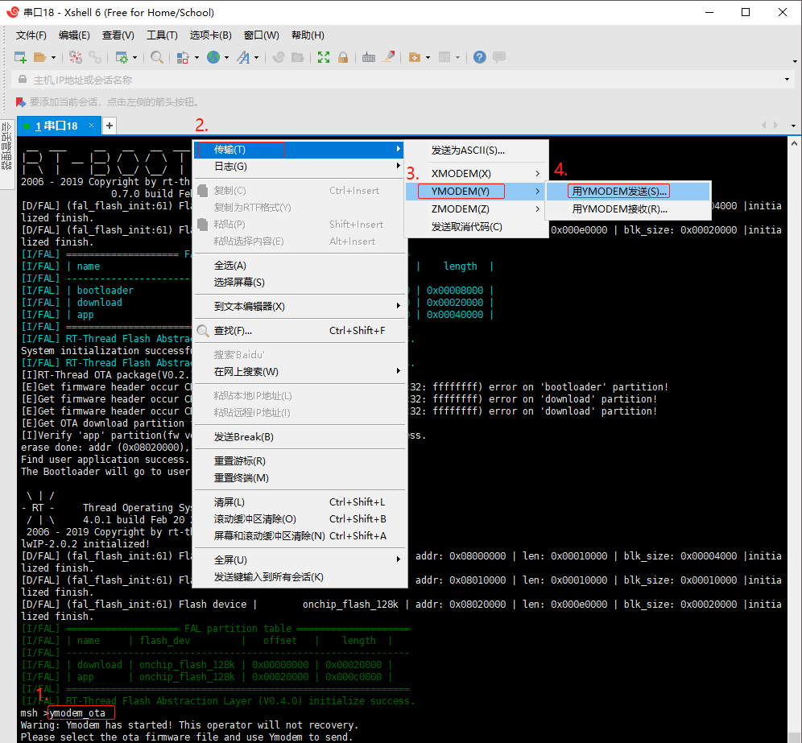

# OTA Downloader

## 1、介绍

OTA Downloader 是与 OTA 服务器对应的客户端程序，用于将 OTA 固件从 OTA 服务器下载到设备。常用的且通用的 OTA Downloader 有 Y-modem（串口升级） 和 HTTP OTA（网络升级），开发者使用自己的电脑既可搭建用于 OTA 升级的服务端。私有云或者公有云平台提供的 OTA 服务器，通常需要开发对应的客户端程序，运行在设备端，用于下载 OTA 固件。

### 1.1 许可证

OTA Downloader package 遵循 LGPLv2.1 许可，详见 `LICENSE` 文件。

### 1.2 依赖

- RT-Thread 3.0+
- fal 软件包支持
- Y-modem 下载方式依赖于 Y-modem 组件
- http 下载方式依赖于 webclient 软件包

## 2、如何打开 OTA Downloader

使用 ota_downloader package 需要在 RT-Thread 的包管理器中选择它，具体路径如下：

```
RT-Thread online packages
    IoT - internet of things  --->
        [*]  OTA Downloader : Various firmware downloaders on rt-thread  --->
```

然后让 RT-Thread 的包管理器自动更新，或者使用 `pkgs --update` 命令更新包到 BSP 中。

## 3、使用 OTA Downloader

在打开 ota_downloader package 后，当进行 bsp 编译时，它会被加入到 bsp 工程中进行编译。
烧录程序到目标开发板，用户可在 FinSH 终端找到两个命令：`http_ota` 和 `ymodema_ota`。

 1. http_ota ： 使用 HTTP 协议固件升级
 2. ymodema_ota ： 使用 Ymodem 协议固件升级

### 3.1 使用 Ymodem 协议固件升级

推荐使用支持 YMODEM 协议的 Xshell 。在终端输入 ymodem_ota 命令后，鼠标右键然后在菜单栏找到用 YMODEM 发送选项。具体步骤如下图：



### 3.2 使用 HTTP 协议固件升级

在终端输入 http_ota http://xxx/xxx/rtthreadf.rbl 命令。具体步骤如下图所示：


## 4、注意事项

> 更多详细信息可参考 《RT-Thread OTA 用户手册》: docs/UM1004-RT-Thread-OTA 用户手册.pdf

## 5、联系方式 & 感谢

* 维护：RT-Thread 开发团队
* 主页：https://github.com/RT-Thread-packages/ota_downloader
